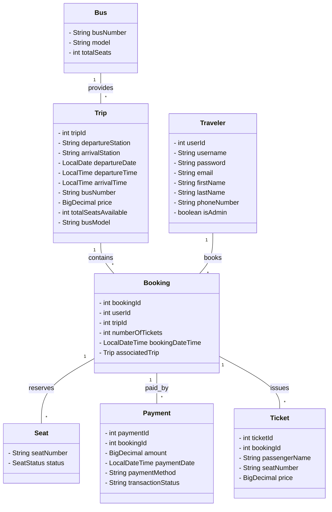

# Bus Reservation System

## Overview
This project is a Java-based Bus Reservation System with a graphical user interface (GUI) built using Swing. It allows users to search for bus trips, book seats, manage bookings, and for administrators to manage buses, trips, and users. The system uses a MySQL database for persistent storage.

## Features
- **User Registration & Login**: Users can sign up and log in to the system.
- **Trip Search**: Search for available bus trips by departure and arrival stations and date.
- **Seat Selection**: Interactive seat selection for booking.
- **Booking Management**: View and manage your bookings.
- **Admin Dashboard**: Admins can manage buses, trips, users, and view all bookings.
- **Profile Management**: Users can view and update their profile information.
- **Payment Processing**: Simulated payment processing for bookings.
- **Ticket Generation**: Tickets are generated for each booking and seat.

## Main Modules
- **Bus**: Represents a bus with a unique number, model, and total seats.
- **Trip**: Represents a scheduled trip, including departure/arrival info, bus, price, and available seats.
- **Traveler**: Represents a user (regular or admin) with personal and login details.
- **Booking**: Represents a booking made by a user for a specific trip and seats.
- **Seat**: Represents a seat on a bus, with status (available/booked/selected).
- **Payment**: Handles payment information and processing for bookings.
- **Ticket**: Represents a ticket issued for a specific seat and booking.
- **DTOs**: Data Transfer Objects like `BookingDetailView` aggregate and present booking-related data.
- **Utils**: Utility classes for date/time formatting and other helper functions.
- **UI Constants**: Centralized UI styling and layout constants in `UIConstants.java`.
- **UpdatablePanel Interface**: Interface for UI panels that support dynamic data updates.

## UML Class Diagram
Below is a simplified UML class diagram of the core entities:

## How to Run
1. **Database Setup**: Ensure you have MySQL running and update the connection details in `Database.java` if needed. Import the required schema and tables.
2. **Build & Run**: Compile the Java code and run the `BusBookingGUI` main class (found in `Code/ui/BusBookingGUI.java`).
3. **Login or Sign Up**: Use the GUI to register a new account or log in.

## Directory Structure
- `Code/` - Main Java source code
  - `Admin.java`, `Booking.java`, `Bus.java`, `Database.java`, `Payment.java`, `Seat.java`, `Ticket.java`, `Traveler.java`, `Trip.java`, `Utils.java`
  - `service/` - Business logic and database interaction
    - `BookingService.java`, `BusService.java`, `TripService.java`, `UserService.java`
  - `ui/` - GUI panels and components
    - `AdminDashboardPanel.java`, `AuthChoicePanel.java`, `BookingConfirmationPanel.java`, `BusBookingGUI.java`, `HomePanel.java`, `LoginPanel.java`, `ManageBusesPanel.java`, `ManageTripsPanel.java`, `ManageUsersPanel.java`, `MyBookingsPanel.java`, `ProfilePanel.java`, `SearchResultsPanel.java`, `SeatSelectionPanel.java`, `SignUpPanel.java`, `UpdatablePanel.java`, `ViewAllBookingsPanel.java`, `WelcomePanel.java`
    - `utils/` - UI constants and resources
      - `UIConstants.java`, `icons/` (background.png, finish.png, return.png, user.png)
  - `dto/` - Data transfer objects
    - `BookingDetailView.java`

## Screenshots & Diagrams
- The project includes a UML diagram (`UML BusBooking.drawio.png`) for a visual overview of the system structure.
- UI icons and resources are located in `Code/ui/utils/icons/`.

## Authors
- Ahmed Ragab Moslim

## License
This project is for educational purposes. 
